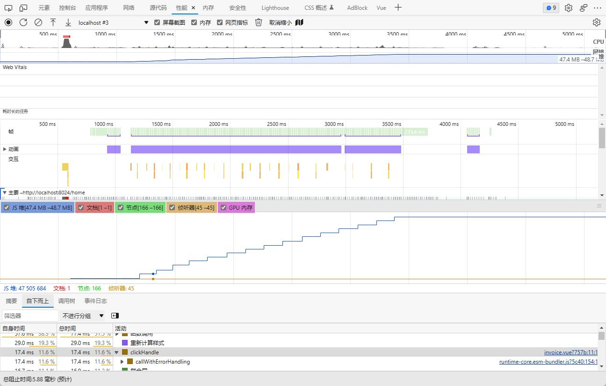
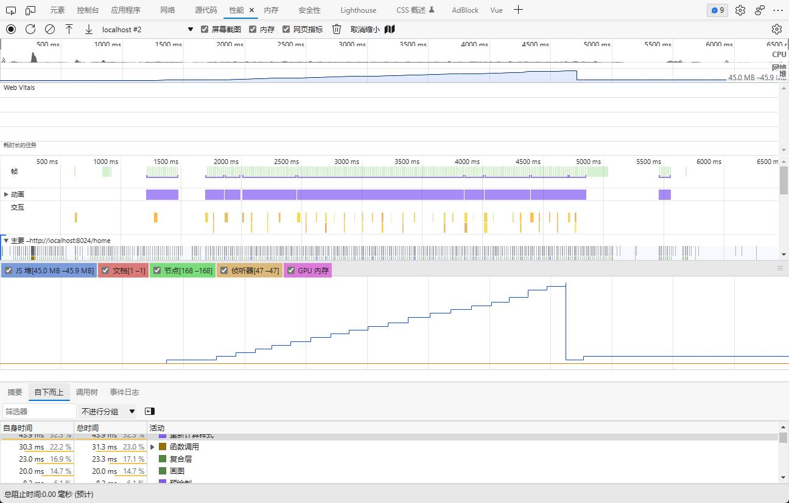

# 用 Performance 和 Memory 监控内存泄露

很多前端都喜欢用 `console.log `调试，先不谈调试效率怎么样，首先 `console.log` 有个致命的问题：会导致内存泄漏。
为什么这么说呢？
用 Performance 和 Memory 工具分析下就知道了。

```HTML
<!-- Vue -->
<el-button @click="clickHandle">CLICK ME</el-button>
```

```JavaScript
const clickHandle = () =>{
  const arr = new Array(10000)
  console.log(arr)
}
```

一个按钮，点击之后创建一个数组，执行一些计算。
很常见的逻辑。
我们最后加了一个 `console.log` 打印了下这个数组。
打开控制台，点击 `performance` 下的垃圾回收按钮，手动触发一次 GC（收集垃圾）：


勾选 `Memory`，然后开始录制，点击 14 次按钮，再执行一次 GC，你会发现内存是这样的：



内存占用有十四次增长，因为我们点击三次按钮的时候会创建 14 次大数组。但是最后我们手动 GC 之后并没有回落下去，也就是这个大数组没有被回收。按理来说，代码执行完，那用的内存就要被释放，然后再执行别的代码，结果这段代码执行完之后大数组依然占据着内存，这样别的代码再执行的时候可用内存就少了。

这就是发生了内存泄漏，也就是代码执行完了不释放内存的流氓行为。

有同学说，只是这么一点内存问题不大呀，反正可用内存还很多。但如果你的代码要跑很长时间，这段代码要执行很多次呢？每次执行都会占据一部分内存不释放，慢慢的内存就不够用了，甚至会导致程序崩溃。

那为啥说是 `console.log` 导致的呢？
我们来看看不用 `console.log` 是什么样的：



分配了多次内存，但是 GC 后又会落下去了。这才是没有内存泄漏的好代码。

那为啥 `console.log` 会导致内存泄漏呢？
因为控制台打印的对象，你是不是有可能展开看？那如果这个对象在内存中没有了，是不是就看不到了？
所以有这个引用在，浏览器不会把你打印的对象的内存释放掉。

当然，也不只是 `console.log` 会导致内存泄漏，还有别的 4 种情况：

-   定时器用完了没有清除，那每次执行都会多一个定时器的内存占用，这就是内存泄漏
-   元素从 `dom` 移除了，但是还有一个变量引用着他，这样的游离的 `dom` 元素也不会被回收。每执行一次代码，就会多出游离的 `dom` 元素的内存，这也是内存泄漏
-   闭包引用了某个变量，这个变量不会被回收，如果这样的闭包比较多，那每次执行都会多出这些被引用变量的内存占用。这样引用大对象的闭包多了之后，也会导致内存问题
-   全局变量，这个本来就不会被 GC，要注意全局变量的使用

总之，**全局变量、闭包引用的变量、被移除的 `dom` 依然被引用、定时器用完了没清除、`console.log` 都会发生代码执行完了，但是还占用着一部分内存的流氓行为，也就是内存泄漏**。

注意，这里指的是使用完毕后没有回收，在使用期间的内存增长是正常的。
其实普通项目也还好，不会长期跑，但是类似大屏项目这种长期跑的，一旦有内存泄漏，一定会崩溃，只有时间长短的区别。

###### 如何通过代码查看内存大小？

通过 `performance.memory.totalJSHeapSize` 是可以拿到堆内存大小的。

```JavaScript
const MB = 1024 * 1024;
const memory = performance.memory.totalJSHeapSize;
const usagedMemory = Math.floor(memory / MB);
```

`string` 因为常量池的存在，同样的字符串只会创建一次。`new String` 的话才会在堆中创建一个对象，然后指向常量池中的字符串字面量。

此外，`nodejs` 打印的是序列化以后的对象，所以是没有内存泄漏的。
