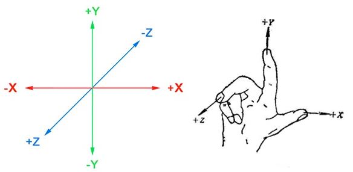
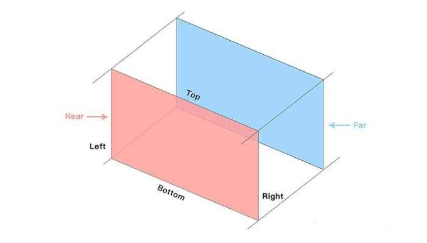
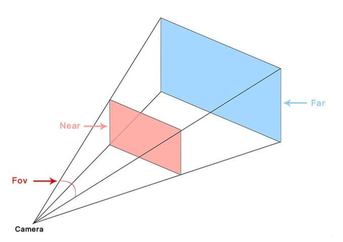
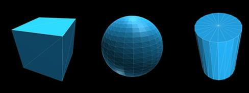
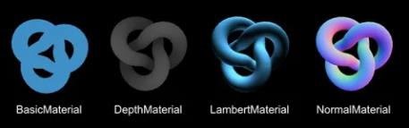
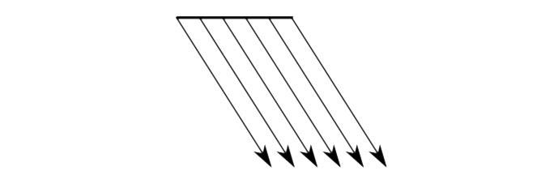
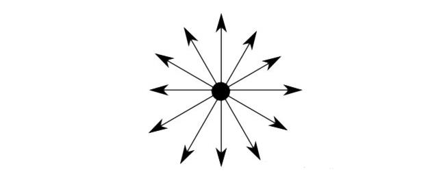
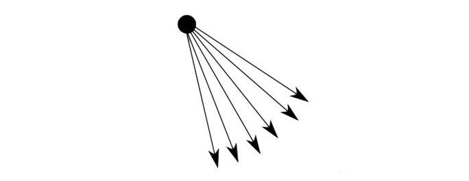

# Three.js 的 3D 世界

使用 `Three.js` 前，首先要理解以下几个核心概念：

### Sence 场景

在 `Three.js` 中首先需要创建一个三维空间，我们称之为场景。场景可以想象成是一个容器，里面存放着所有渲染的物体和使用的光源。

### Axes 坐标轴

`Three.js` 采用的是右手坐标系，拇指、食指、中指分别表示 X、Y、Z 轴的方向。



### Camera 摄像机

摄像机就相当于我们的双眼，决定了能够在场景中的所见所得。
`Three.js` 中提供以下几种摄像机类型，最为常用的是`PerspectiveCamera 透视摄像机`。

##### [ArrayCamera 阵列摄像机](https://threejs.org/docs/#api/zh/cameras/ArrayCamera)

一个 `ArrayCamera` 会包含多个子摄像机，通过这一组子摄像机渲染出实际效果，适用于 `VR` 场景。本质应该是`shift camera`原理（成像平面投射偏离）的应用。`WebGL`中的`ArrayCamera`设计意图是为`VR`场景高效渲染提供支持，但是目前实际上只是提供了多子视口的渲染支持。

`new THREE.ArrayCamera(Array)`：创建一组相机，其参数是一个数组，数组中的每一个值都是一个`THREE.Camera`。可用此方法使用多个相机在不同位置拍摄场景，并分屏放置画面。

##### [CubeCamera 立方摄像机](https://threejs.org/docs/#api/zh/cameras/CubeCamera)

创建六个 `PerspectiveCamera`（透视摄像机），适用于镜面场景。

```JavaScript
let cubeCamera = new THREE.CubeCamera(0.1, 10000, 128);//实例化一个cubeCamera
scene.add(cubeCamera);//将其添加到场景中
let dynamicEnvMaterial = new THREE.MeshBasicMaterial({
    envMap: cubeCamera.renderTarget, side: THREE.DoubleSide
}); //新建一个动态环境材料，envMap为环境贴图，设置为cubeCamera的渲染目标
cubeCamera.updateCubeMap(renderer, scene);//更新渲染立方体贴图
```

`THREE.CubeCamera(near, far, cubeResolution)`总共接收三个参数，前两个参数表示最近距离和最远距离，和`THREE.PerspectiveCamera`中的`near`和`far`一个道理，最后一个参数按字面理解为立方体分辨率，通俗的理解为物体对场景反光的清晰度，即越大越清晰，可以取 128、256、512、1080 等。
[用`Three.js`写一个反光球：360 全景 + 镜面反射](https://juejin.cn/post/6989109490285019172#heading-7)实现效果如下图：


##### [StereoCamera 立体相机](https://threejs.org/docs/?q=StereoCamera#api/zh/cameras/StereoCamera)

双透视摄像机适用于 3D 影片、视差效果。

##### [OrthographicCamera 正交摄像机](https://threejs.org/docs/#api/zh/cameras/OrthographicCamera)

OrthographicCamera（正交摄像机）定义了一个矩形可视区域，物体只有在这个区域内才是可见的，另外物体无论距离摄像机是远或事近，物体都会被渲染成一个大小，所以这种摄像机类型适用于 2.5D 场景（例如斜 45 度游戏）。

> 正交投影，是指像空间 U 和零空间 W 相互正交子空间的投影。
>
> 在线性代数和泛函分析中，投影是从向量空间映射到自身的一种线性变换，是日常生活中“平行投影”概念的形式化和一般化。同现实中阳光将事物投影到地面上一样，投影变换将整个向量空间映射到它的其中一个子空间，并且在这个子空间中是恒等变换。



##### [PerspectiveCamera 透视摄像机](https://threejs.org/docs/?q=PerspectiveCamera#api/zh/cameras/PerspectiveCamera)

最为常用的摄像机类型，模拟人眼的视觉，根据物体距离摄像机的距离，近大远小。默认情况下，摄像机的初始位置 X、Y、Z 都为 0，摄像机方向是从正 Z 轴向负 Z 轴看去。通过 `Near` 和 `Far` 定义最近和最远的可视距离，`Fov` 定义可视的角度。

> 透视投影属于中心投影。透视投影图简称为透视图或透视，它是从某个投射中心将物体投射到单一投影面上所得到的图形。透视投影符合人们心理习惯，即离视点近的物体大，离视点远的物体小，远到极点即为消失，成为灭点。现实生活中的景物，由于观察距离及方位的不同在视觉上会引起不同的反映，这种现象就是透视现象。(摘自百度百科：[透视投影](https://baike.baidu.com/item/透视投影/9995986))



### Mesh 网格

有了场景和摄像头就可以看到 3D 场景中的物体，场景中的我们最为常用的物体称为网格。
网格由两部分组成：几何体和材质

##### Geometry 几何体

记录了渲染一个 3D 物体所需要的基本数据：`Face` 面、`Vertex` 顶点等信息。
例如下面这个网格是由三角形组成，组成三角形的点称为顶点，组成的三角形称为面。



##### Material 材质

材质就像是物体的皮肤，决定了几何体的外表。
外表的定义可以让一个物体看起来是否有镜面金属感、暗淡、纯色、或是透明与否等效果。



### Light 光源

光源相当于在密闭空间里的一盏灯，对于场景是必不可少的。

##### AmbientLight 环境光源

属于基础光源，为场景中的所有物体提供一个基础亮度。
环境光会均匀的照亮场景中的所有物体。
环境光不能用来投射阴影，因为它没有方向。

##### DirectionalLight 平行光源

效果类似太阳光，发出的光源都是平行的。
平行光是沿着特定方向发射的光。这种光的表现像是无限远,从它发出的光线都是平行的。常常用平行光来模拟太阳光的效果; 太阳足够远，因此我们可以认为太阳的位置是无限远，所以我们认为从太阳发出的光线也都是平行的。
平行光可以投射阴影。



##### HemisphereLight 半球光

只有圆球的半边会发出光源。
光源直接放置于场景之上，光照颜色从天空光线颜色渐变到地面光线颜色。
半球光不能投射阴影。


##### PointLight 点光源

一个点向四周发出光源，一般用于灯泡。从一个点向各个方向发射的光源。一个常见的例子是模拟一个灯泡发出的光。
该光源可以投射阴影。



##### SpotLight 聚光灯光源

一个圆锥体的灯光。光线从一个点沿一个方向射出，随着光线照射的变远，光线圆锥体的尺寸也逐渐增大。
该光源可以投射阴影。



### Shadow 阴影

另外要注意并不是每一种光源都能产生阴影，目前只有三种光源可以：

-   DirectionalLight 平行光源
-   PointLight 点光源
-   SpotLight 聚光灯光源

另外如果要开启模型的阴影的话，模型是由多个 `Mesh` 组成的，只开启父的 `Mesh` 的阴影是不行的，还需要遍历父 `Mesh` 下所有的子 `Mesh` 为其开启投射阴影 `castShadow` 和接收投射阴影 `receiveShadow`。

```JavaScript
// 遍历子 Mesh 开启阴影
object.traverse(function(child) {
  if (child instanceof THREE.Mesh) {
     child.castShadow = true
     child.receiveShadow = true
   }
})
```
