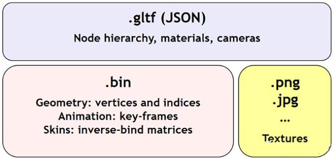
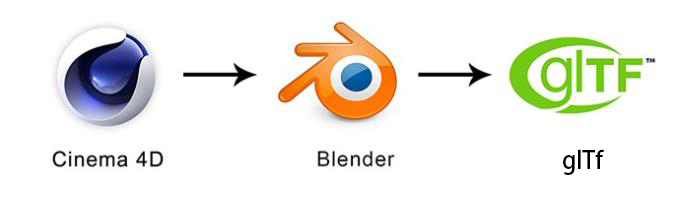

# glTF 模型格式

`Three.js` 引擎支持的格式非常的多，我们最为常见的格式有 `.obj` + `.mtl` + `.jpg/.png`，但使用这种模型格式存在一个问题，`.obj` 是静态模型，不支持动画数据存储，无法使用模型的动画，所以建议使用 `glTF` 这种模型格式。

### `glTF` 模型格式介绍

传统的 3D 模型格式的设计理念更多是针对本地离线使用，所以这类 3D 模型格式没有针对下载速度或加载速度进行优化，文件大小往往会非常的大，随着 Web 端的兴起，对文件大小更为敏感的今天，我们该尝试别的模型格式了。

`glTF` 是由 Khronos Group 开发的 3D 模型文件格式，该格式的特点是最大程度的减少了 3D 模型文件的大小，提高了传输、加载以及解析 3D 模型文件的效率，并且它可扩展，可互操作。

第一版 `glTF 1.0` 于 2015 年 10 月 19 日发布，2017 年 6 月 5 日的 Web 3D 2017 大会发布了最终版本 `glTF 2.0`。

### `glTF` 模型格式文件组成



##### 模型文件 `.gltf`

包含场景中节点层次结构、摄像机、网格、材质以及动画等描述信息。

##### 二进制文件 `.bin`

包含几何、动画的数据以及其他基于缓冲区的数据，`.bin` 文件可以直接加载到 GPU 的缓冲区中从而不需要额外的解析，因此能够高效传输和快速加载。

##### 材质贴图文件 `.png` / `.jpg`

3D 模型做凹凸贴图或普通贴图上所使用到文件。

##### `glTF` 模型格式导出

官方在 `glTF` 格式导出上提供了多种建模软件的导出插件，比如有：

-   3DS Max Exporter
-   Maya Exporter
-   Blender glTF 2.0 Exporter
-   ...

常用的 C4D 建模软件官方没有提供 C4D 的导出插件，所以使用 C4D 导出后再导入 Blender，通过 Blender 作为中转站导出 `glTF` 格式文件。



但由于两个建模软件之间的材质并不能相通，导出后的模型文件材质效果表现不佳，这是因为 Blender 有自己的一套材质流程系统，例如有 glTF Metallic Roughness 和 glTF Specular Glossiness，需在此基础之上重新贴材质后导出解决。

另外注意的一点 Blender 的坐标系与 `Three.js` 是不同的，Blender 会将 Z 和 Y 对调位置，在导出时要选择 `Convert Z up to Y up` 进行对调。

### `Three.js` 使用 `glTF` 模型

> 目前文中给出的加载器已无法在`github`上找到，所以具体是否可行需要验证

`Three.js` 中使用 `glTF` 格式需额外引入 `GLTFLoader.js` 加载器。

```JavaScript
var gltfLoader = new THREE.gltfLoader()

gltfLoader.load('./assets/box.gltf', function(sence) {
   var object = scene.gltf // 模型对象
   scene.add(object) // 将模型添加到场景中
})
```

### `glTF` 模型动画

##### Animation Clip 动画片段

前面提到 `glTF` 模型格式支持动画，模型动画可以使用 Blender 建模软件制作，通过 Blender 提供的时间轴编辑变形动画或者骨骼动画，每个动画可以编辑为一个 Action 动作，导出后使用 `GLTFLoader` 加载到 `Three.js` 中，可以拿到一个 `animations` 数组，`animations` 里包含了模型的每个动画 Action 动作。

```JavaScript
let gltfLoader = new THREE.gltfLoader()
let mixer = null

gltfLoader.load('./assets/box.gltf', function(model) {
   let object = scene.gltf
   let animations = model.animations // 动画数据

   if (animations && animations.length) {
     mixer = new THREE.AnimationMixer(object) // 对动画进行控制
     for (let i = 0; i < animations.length; i++) {
       mixer.clipAction(animations[i]).play() // 播放所有动画
     }
   }
   scene.add(object)
})

function update() {
  let delta = clock.getDelta(mixer)
  mixer.update(delta) // 更新动画片段
}
```
