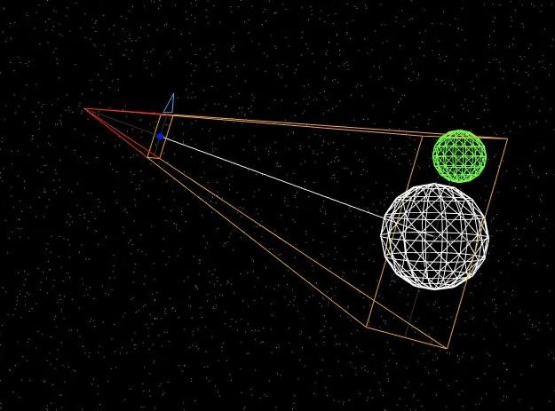
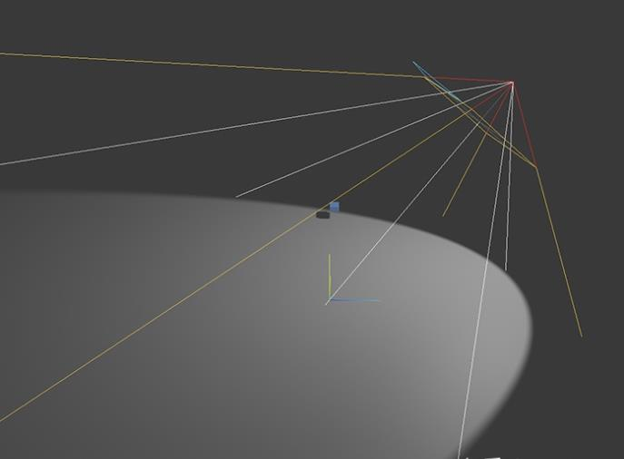
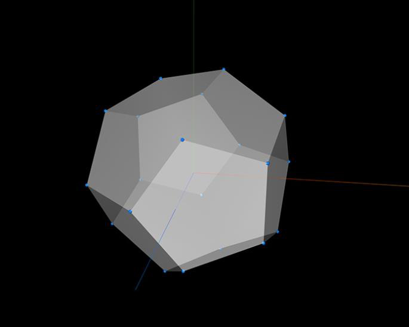
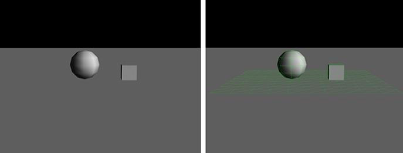

# 调试开发小工具

### `Camera Helper` 摄像机调试模式

开启 `Camera Helper` 调试模式后，可以直观的看到 `Camera` 的 `Fov`、 `Nera`、`Far`的参数效果。



```JavaScript
let camera = new THREE.PerspectiveCamera(45, window.innerWidth / window.innerHeight, 0.1, 1000)
let helper = new THREE.CameraHelper(camera)

scene.add(helper)
```

### `Light Helper` 光源调试模式

聚光灯开启 `Light Helper` 调试模式后，可以直观的看到 `distance`、`angle` 的参数效果。



```JavaScript
let light = new THREE.DirectionalLight(0xffffff)
let helper = new THREE.DirectionalLightHelper(0xffffff)

scene.add(helper)
```

### `AxesHelper` 坐标轴调试模式

`AxesHelper` 是在场景的中心点，添加一个坐标轴（红色：X 轴、绿色：Y 轴、蓝色：Z 轴），方便辨别方向。



```JavaScript
let axesHelper = new THREE.AxesHelper(10)

scene.add(axesHelper)
```

### `Cannon.js` 3D 物理引擎调试模式
`Cannon.js` 3D 物理引擎提供的调试模式需引入 [Debug renderer for Three.js](https://github.com/schteppe/cannon.js/tree/master/tools/threejs)，可以将创建的物理盒子、球、平面等显示线框，便于在使用过程中实时查看效果。



```JavaScript
let cannonDebugRenderer = new THREE.CannonDebugRenderer(scene, world)

function render() {
 requestAnimationFrame(render)
 cannonDebugRenderer.update() // Update the debug renderer
}
```
### `dat.GUI` 图形用户界面调试工具

在开发过程中，常常需要对参数变量进行微调，针对这个 `Three.js` 提供了 [`dat.GUI`](https://github.com/dataarts/dat.gui)，`dat.GUI` 是一个轻量级的图形用户界面调试工具，使用后在右上角会出现一个 `GUI` 可视化参数配置区域，通过修改数值来实时查看结果。

```JavaScript
let opts = {
  x: 0,
  y: 0,
  scale: 1
}

let gui = new dat.GUI()
gui.add(opts, 'x', -3, 3)
gui.add(opts, 'y', -3, 3)
gui.add(opts, 'scale', 1, 3)

function loop() {
  cube.position.x = opt.x
  cube.position.y = opt.y
  cube.scale.set(opts.scale, opts.scale, opts.scale)

  requestAnimationFrame()
}
```

### Stats 调试工具

[Stats](https://github.com/mrdoob/stats.js/) 工具可以实时查看：

-   FPS：最后一秒的帧数，越大越流畅
-   MS：渲染一帧需要的时间（毫秒），越低越好
-   MB：占用的内存信息
-   CUSTOM：自定义面板

```JavaScript
const stats = new Stats()
stats.showPanel(1)
document.body.appendChild(stats.dom)

function animate() {
  requestAnimationFrame(animate)
}

requestAnimationFrame(animate)
```
